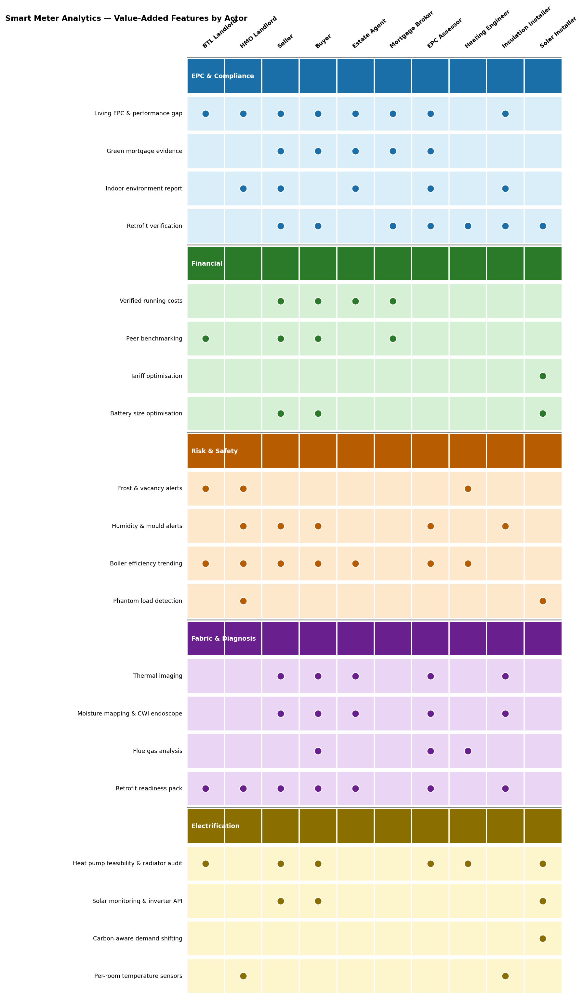

# Smart Meter Analytics — Value-Added Features by User Type

---

## Conventional BTL Landlords

- Frost alert during void periods (burst pipe prevention)
- Unexpected activity alert in empty property (break-in / appliance fault)
- Boiler efficiency trending — early warning before breakdown
- Living EPC band tracking — monitor compliance trajectory toward EPC C requirement
- Retrofit readiness pack — prioritise upgrade spend across portfolio
- Peer benchmarking — rank portfolio by heating efficiency, target worst performers
- Heat pump feasibility — plan electrification ahead of regulation

---

## HMO Landlords

All of the above, plus:

- Per-room temperature sensors — individual room condition monitoring
- Humidity and mould alerts — early warning with timestamped evidence record (Awaab's Law)
- Indoor environment report — CO₂, CO, humidity across multiple rooms for compliance documentation
- Smart TRVs — heating distribution visibility without tenant intrusion
- Phantom load detection in common areas
- Multi-zone comfort vs cost report

---

## Domestic Sellers

- Living EPC — demonstrate actual performance vs lodged certificate band
- Performance gap report — evidence the property outperforms its EPC rating
- Green mortgage evidence package — buyer can access preferential mortgage rate
- Verified annual running costs — actual consumption history, not modelled estimate
- Peer benchmarking — show property is efficient vs comparable stock
- Boiler condition record — flat efficiency trend removes buyer's negotiating lever
- Indoor environment history — timestamped record of warmth, dryness, and air quality
- Retrofit readiness pack — hand buyer a defined upgrade plan, not uncertainty
- Thermal imaging survey — photographic evidence of insulation quality
- Heat pump feasibility with radiator audit — remove hidden electrification cost risk

---

## Domestic Buyers

- Independent thermal imaging — identify insulation defects not in seller's pack
- Cavity wall endoscope — confirm or challenge CWI claims
- Moisture mapping — damp risk identified before exchange
- Flue gas analysis — actual boiler efficiency, quantify replacement risk
- Performance gap check — identify if property underperforms its certificate
- Running cost verification — reproduce seller's figures from independent data request
- Peer benchmarking — flag if property is a heating efficiency outlier
- Green mortgage eligibility assessment — qualify for preferential rate
- Retrofit readiness pack — define upgrade budget before making an offer
- Radiator sizing audit — expose hidden heat pump installation cost
- Pre-purchase baseline — document property condition at purchase for dispute protection

---

## Estate Agents

**Listing differentiation**
- Living EPC and performance gap report — market actual measured performance, not just the certificate band
- Verified running costs — real consumption history as a marketing claim, not a modelled estimate
- Green mortgage flag on listing — identify properties where buyers can access preferential rates
- Indoor environment history — evidence of warmth, dryness, and air quality as part of the listing pack
- Thermal imaging — photographic fabric evidence to support asking price

**Reducing fall-throughs and renegotiation**
- Pre-listing energy survey — identify boiler, damp, and insulation issues before a buyer's surveyor does
- Boiler condition record — remove surprise maintenance discoveries that erode the agreed price
- Moisture mapping — head off damp-related renegotiations after survey
- Retrofit readiness pack — resolve upgrade cost uncertainty before it becomes a counter-offer

**Buyer matching**
- Green mortgage pre-qualification — match buyers with green mortgage approval to eligible properties
- EPC performance data as a search filter — surface properties where measured band exceeds the lodged certificate

**Revenue diversification**
- Referral to enhanced EPC, heating health check, and indoor environment report services
- Retrofit readiness pack commissioned at point of instruction
- Smart meter monitoring enrolment at completion — ongoing relationship beyond the transaction

**Post-sale retention**
- Enrol property in continuous smart meter monitoring at point of sale
- Agent becomes the natural referral point for future boiler, insulation, and upgrade assessments
- Living EPC updates create a reason to re-engage the vendor ahead of re-sale

---

## Mortgage Brokers

**Green mortgage sourcing**
- Green mortgage eligibility check at first client meeting — identify qualifying properties before product search
- Lender matching by evidence type — distinguish lenders with a hard EPC band gate from those accepting measured performance evidence (Feature 13d)
- Performance gap assessment — identify properties where measured fabric performance exceeds the lodged certificate band, opening green mortgage eligibility that the EPC alone would exclude
- Living EPC band as qualification evidence — monthly-updated measured band submitted alongside or in place of a stale certificate

**Remortgage triggers**
- Living EPC band improvement after retrofit — automatic prompt to review whether the client now qualifies for a green rate
- Retrofit verification report (Feature 13c) — statistical confirmation that an improvement measure worked, usable as evidence for a remortgage application
- EPC uplift pathway advice — tell the client which single measure is most likely to shift their band and unlock a better rate, before they commission unnecessary works

**BTL and portfolio clients**
- EPC compliance tracker across portfolio — flag properties at risk of falling below the anticipated minimum EPC C requirement before a mortgage renewal falls due
- Boiler condition record — flag near-term replacement risk on portfolio properties ahead of a remortgage, where a lender may require a satisfactory heating system condition report
- Retrofit readiness pack — support BTL clients planning upgrade spend to meet compliance deadlines

**Affordability and client advice**
- Verified annual running costs — real consumption data to support affordability discussions, replacing estimated figures from EPC modelling
- Budget forecast — projected monthly energy cost for the remainder of the year, useful for clients on tight affordability margins
- Peer benchmarking — show client how the property's running costs compare to similar stock, supporting or challenging the asking price

**Client retention**
- Enrol clients in smart meter monitoring at completion — broker becomes the referral point when living EPC improves enough to trigger a remortgage conversation
- Annual green mortgage review — living EPC updates provide a structured, data-backed reason to contact clients each heating season
- Portfolio dashboard for landlord clients — recurring engagement on compliance and remortgage eligibility across multiple properties

---

## EPC Assessors

**Revenue per visit — tiered add-on services**
- Enhanced EPC (£50–80 additional) — thermal imaging walkround, loft depth probe, moisture check, CO₂ and humidity snapshot; photographic evidence report
- Heating system health check (£40–60 additional) — flue gas analysis, radiator sizing, flow temperature check; boiler efficiency reading and heat pump feasibility verdict
- Indoor environment report (£30–50 additional) — CO₂, CO, humidity, and temperature at multiple points; ventilation failure and mould risk flagging
- Retrofit readiness pack (£80–120 additional) — combines all of the above with cavity wall endoscope and solar/EV suitability; prioritised improvement schedule with costs and payback periods

**Certificate accuracy — reducing reliance on age-band defaults**
- Loft insulation depth probe — precise measurement vs visual estimate; difference of 150mm vs 300mm can shift the EPC band
- Flue gas analyser — actual boiler combustion efficiency on the day, replacing the SAP default assumption
- Thermal imaging — confirms or challenges default U-value assumptions; identifies specific elements driving the score
- Cavity wall endoscope — unambiguous evidence of CWI presence and condition, resolving the ambiguity a thermal image alone cannot
- Radiator sizing assessment — key input for heat pump feasibility; rarely done on a standard visit

**Liability reduction**
- Moisture meter — identifies walls above 20% moisture content where CWI is contraindicated; prevents a defective measure recommendation
- CO detector — flags sub-acute poisoning risk near gas appliances that a standard EPC visit would not detect
- Damp mapping — documents condition at the time of assessment, protecting the assessor against post-certificate complaints

**New client segments**
- Pre-listing survey for sellers — commissioned before marketing, independent of the sale EPC
- Pre-purchase survey for buyers — independent fabric and heating assessment before exchange
- Landlord compliance reports — indoor environment evidence for EPC C trajectory and Awaab's Law obligations
- Green mortgage evidence package (Feature 13d) — structured fabric performance report for lender submission

**Ongoing relationship beyond the one-off certificate**
- Smart meter monitoring enrolment at point of visit — assessor installs indoor sensor, enables data sharing, explains the system
- Living EPC updates reference the assessor's baseline measurement — maintaining professional visibility between visits
- Retrofit verification return visit (Feature 13c) — statistical before/after comparison after insulation or window installation
- Natural referral point when the system recommends a U-value survey, blower door test, boiler service, or heat pump assessment

---

## Heating Engineers

**Proactive service referrals**
- Boiler efficiency trending (Feature 5) — step-change or gradual degradation alert triggers a service call before breakdown, replacing reactive emergency call-outs
- Micro-leak detection (Feature 10) — sustained overnight gas above baseline flags a possible boiler fault or gas issue for immediate investigation
- Frost alert with heating failure (Feature 10) — boiler expected to be running but no gas detected, combined with frost forecast; referral before the client comes home to a cold house
- Heating efficiency scoring (Feature 6) — identifies properties where normalised gas consumption is rising, indicating system performance problems

**Heat pump — pre-installation**
- Heat pump feasibility report (Feature 4) — modelled COP at current and alternative flow temperatures, with payback period; positions the engineer's quote against an independent analysis
- Radiator sizing assessment — output at 45–50°C flow vs current 70–80°C requirement; identifies which radiators need upgrading before installation, preventing underperformance complaints post-commissioning
- Flow temperature measurement (flow/return probes) — actual system flow temperature rather than assumed value; the single largest source of COP modelling uncertainty

**Heat pump — post-installation**
- Heat meter — directly measured seasonal COP vs MCS-rated performance; confirms the installation is delivering what was promised and supports warranty and ECO4 compliance sign-off
- Retrofit verification (Feature 13c) — statistical before/after comparison of fabric heat loss; distinguishes heating system improvement from building fabric performance
- COP monitoring — ongoing seasonal performance tracking; early warning of refrigerant loss, fouling, or control system issues

**System balancing and optimisation**
- Flow and return temperature probes — delta-T monitoring indicates whether heat is being extracted efficiently; a small delta-T suggests sludge, airlocks, or an oversized pump
- Hot water cylinder sensor — confirms weekly 60°C legionella pasteurisation cycle; measures cylinder standing heat loss; identifies whether immersion heater is duplicating boiler output
- Boiler pre-warm optimisation (Feature 9) — data on actual boiler start behaviour supports smart thermostat recommendations and system scheduling advice

**New service lines**
- Sensor installation — flow/return probes, cylinder sensor, and indoor temperature sensors as a billable add-on to a service visit
- Annual heating system efficiency report — compiled from smart meter trending data, flue gas reading, and flow temperature measurement
- Post-installation monitoring setup — enrol client in smart meter data sharing and heat pump COP tracking at point of commissioning

**Client retention**
- Boiler efficiency alerts create a direct, data-backed trigger for the annual service call
- Heat pump COP dashboard — ongoing seasonal performance data maintains the relationship beyond installation
- System alerts (frost, micro-leak, efficiency decline) route to the engineer as the named professional contact, replacing ad hoc emergency calls with a managed service relationship

---

## Insulation Installers

**Pre-installation survey**
- Thermal imaging walkround — identifies exactly which wall sections, roof areas, and window reveals are losing heat; directs the measure to where it will have most impact rather than treating the whole building envelope uniformly
- Cavity wall endoscope — confirms whether existing CWI is present, settled, or absent in sections before recommending a full re-fill; avoids unnecessary works where partial failure has occurred
- Moisture meter — flags walls above 20% moisture content where CWI is contraindicated; prevents a defective installation and protects the installer against post-works complaints and ECO4 non-compliance
- Performance gap baseline (Feature 13a) — quantifies the gap between measured heat loss and EPC prediction before works begin; sets a credible improvement target and supports the grant application

**Directing spend: fabric vs infiltration**
- Wind-speed regression on τ estimates — distinguishes heat loss driven by fabric conductivity from heat loss driven by air infiltration; prevents installing insulation where draught-proofing would deliver a better return
- CO₂ tracer gas decay — measures natural air change rate; if the property is leaky, air-tightness works should precede or accompany insulation to avoid condensation risk in the newly insulated fabric
- Blower door pre-screening — decision framework for whether a full blower door test is warranted before recommending solid wall insulation, where air-tightness interaction is a known risk

**Post-installation verification**
- Retrofit verification (Feature 13c) — statistical before/after comparison of τ and heat loss coefficient after a 6-week settling period; confirms whether the improvement matches the claimed performance with a stated confidence level
- Living EPC band update (Feature 13b) — immediate measured band update after works, without waiting for a formal RdSAP reassessment; provides the client with an updated certificate within one heating season
- Measured U-value via heat flux plates — where the τ improvement is large enough to warrant it, directed in-situ U-value measurement confirms which element is responsible and provides element-level evidence for EPC lodgement
- Green mortgage eligibility — if post-installation performance crosses a band threshold, the retrofit verification report supports a green mortgage application or remortgage

**Avoiding installation failures**
- Humidity monitoring post solid wall insulation — interstitial condensation in the insulation layer is a known failure mode for EWI and IWI; humidity sensors on the internal wall surface detect elevated moisture before visible damage occurs
- Feature 13c underperformance detection — if τ improvement is below the expected range for the measure installed, the statistical test flags it; early detection of a defective installation before the client raises a complaint
- Moisture re-check after CWI — repeat moisture meter readings 6–12 months post-installation confirm the wall is drying rather than wetting up further

**ECO4 and grant scheme compliance**
- Retrofit verification report as post-installation evidence — structured performance data suitable for PAS 2035 compliance documentation, potentially replacing a separate post-installation inspection for straightforward measures
- Performance gap pre-screening for ECO4 eligibility — measured heat loss can support or strengthen a grant eligibility assessment where the EPC band alone is borderline
- Retrofit readiness pack — bridges the gap between an EPC and a full PAS 2035 assessment for clients who need a prioritised improvement plan before committing to a specific measure

**Client retention and referrals**
- Post-installation monitoring package — enrol the client in smart meter monitoring at point of installation; the installer is referenced in the retrofit verification baseline
- Living EPC updates maintain a connection with the property — when the band improves enough to trigger a green mortgage or a further measure, the original installer is the natural referral
- Humidity alert service post solid wall insulation — ongoing monitoring as a paid aftercare product, addressing the interstitial condensation risk that clients and insurers increasingly expect to be managed

---

## Solar Installers

**Pre-installation sizing and feasibility**
- Consumption profile analysis (Feature 3) — half-hourly load data identifies when the household uses electricity and how much; sizes the array against actual demand rather than floor area rules of thumb
- Battery size optimisation (Feature 2) — simulates every common battery size against the client's usage and local tariff before installation; payback curve and 10-year NPV for each size, factoring in solar export data where a previous system exists
- Tariff matching (Feature 1) — identifies which export tariff (SEG, smart export, Agile) maximises the client's return at their usage pattern; Agile and time-of-use tariffs interact differently with solar depending on the household's flexibility
- EV charger and battery storage readiness — visual check of consumer unit capacity, available wall space, and existing circuits at the site survey; single visit covers solar, battery, and EV charger feasibility together
- Appliance detection (Feature 3) — identifies large flexible loads (EV charger, immersion heater, dishwasher) that can be scheduled to maximise solar self-consumption; sets realistic self-consumption rate expectations before installation

**Post-installation monitoring**
- Solar inverter API integration — direct half-hourly generation data from the inverter rather than inferring generation from net import/export figures; gross generation separated cleanly from battery discharge and demand reduction
- Self-consumption rate calculation — proportion of generated electricity used on-site vs exported; tracks whether the system is performing as the installation proposal modelled
- Panel degradation detection — gradual fall in output per unit of irradiance over months indicates soiling, shading from new obstructions, or cell degradation; distinguishes weather variation from genuine underperformance
- Export vs self-consumption optimisation — ongoing analysis of whether shifting flexible loads (washing machine, dishwasher, EV charging) to solar generation windows would materially improve self-consumption, with a pound figure

**Battery upsell and optimisation**
- Battery payback trigger — Feature 2 re-runs annually against current tariff rates and usage; when the payback period drops below the client's threshold, an automatic prompt supports the upsell conversation with fresh numbers
- Battery dispatch performance — compares actual battery behaviour against the optimal rule-based dispatch simulation; identifies whether the battery controller is charging and discharging at the right times given the tariff
- Carbon-aware scheduling (Feature 8) — coordinates battery charge/discharge with National Grid carbon intensity forecast; relevant for clients motivated by carbon reduction as well as cost

**Tariff optimisation**
- SEG and smart export rate comparison — calculates actual export income at current rates vs alternative export tariffs; identifies whether switching export tariff would increase annual return
- Agile tariff analysis — models the client's solar and battery combination against Agile half-hourly prices to determine whether Agile is worth switching to; accounts for the household's actual flexibility rather than assuming full demand shifting

**MCS and grant compliance**
- Generation data for MCS performance verification — inverter API data provides the half-hourly generation record needed to verify system output against the MCS installation estimate
- SEG registration support — confirmed smart meter export data and inverter generation data together provide the metering evidence required for SEG registration with the supplier

**Client retention**
- Annual solar performance report — generation vs forecast, self-consumption rate, export income, and panel degradation assessment; a structured annual touchpoint that positions the installer as the ongoing performance manager
- Degradation alert — automatic notification when output per unit of irradiance falls more than 10% below the installation baseline; creates a service visit opportunity before the client notices independently
- Battery upsell at the right moment — payback analysis re-run against current electricity prices rather than installation-day prices; surfaces the conversation when the numbers actually support it
- EV charger as the natural next step — consumption data shows whether an EV charger would materially increase self-consumption; quantified case for the next installation
